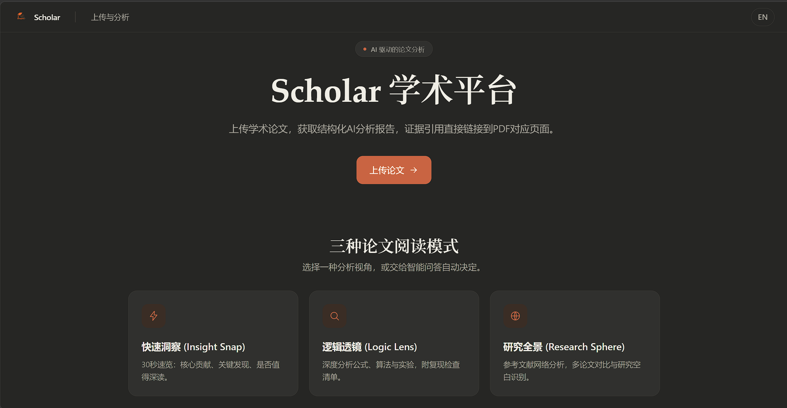

<p align="center">
  
</p>

<h1 align="center">Scholar Platform · AI Paper Reader</h1>

<p align="center">
  Upload a PDF, pick a reading mode, and get a structured AI breakdown <strong>backed by evidence</strong>—<br/>
  every claim carries a page citation you can click to jump straight back to the source PDF.
</p>

<p align="center">
    <a href="https://linux.do/t/topic/2108966/20" alt="LINUX DO">
        </a>
    
    
    
    
    
    
</p>

<p align="center">
  <a href="./README.md">中文 README</a>
</p>

## Preview

<p align="center">
  
</p>

## Highlights

- 📄 **High-fidelity parsing** — MinerU-based PDF parsing that preserves equations, tables, figures, and layout hierarchy.
- 🔍 **Traceable evidence** — every AI claim ships with a page citation; click to jump back to the source PDF and kill hallucinations.
- 🎯 **Four reading modes** — a quick overview, a deep equations/algorithms read, a reference-network map, and a Smart Q&A that picks the path for you.
- 🧠 **Smart Q&A routing** — just ask; an intent classifier routes your question to the best analysis path, or answers directly from the single paper.
- 📚 **Knowledge-base RAG** — search and ask across your own paper corpus (backed by a self-hosted Dify retrieval proxy).
- ⚡ **Streaming output** — progress and results stream live over SSE, so long papers don't leave you waiting.
- 🌍 **Bilingual output + multi-model** — the workflow runs in English internally and translates the final result to English/Chinese; pick the reasoning model from a dropdown.
- 📊 **Journal ranking** — EasyScholar integration surfaces SCI / CCF / CSCD tiers to gauge source quality.

## Reading Modes

| Mode | Best for |
|---|---|
| **Insight Snap** | 30-second triage: contributions, key findings, worth-reading assessment |
| **Logic Lens** | Deep analysis: formulas, algorithms, experiment-reproduction checklist |
| **Research Sphere** | Reference network, citation graph, multi-paper comparison, research gaps — enriched with matches from your knowledge base |
| **Smart Q&A** | Ask a question; the AI detects intent (snap / lens / sphere / single-paper QA) and routes to the best path, or answers directly |

## Knowledge Base

The **Knowledge Base** page lets you work across your own paper corpus:

- **Search** — full-text / semantic / hybrid retrieval over the whole corpus, with document preview and source jump.
- **Ask** — pose a question across many papers; the LLM synthesizes an answer from the retrieved passages and cites its sources.

This is powered by a self-hosted Dify knowledge-base retrieval proxy. Set `DIFY_API_BASE` to enable it; leave it empty and the Knowledge Base page and the Research Sphere "related work in your library" matches are disabled, with everything else unaffected.

## Quick Start (Docker)

### Prerequisites

- Docker >= 24.0
- Docker Compose >= 2.20

### 1. Configure environment variables

```bash
cp .env.example .env
# Edit .env and fill in your API keys
```

**Required** (core parsing & analysis):

| Variable | Description |
|---|---|
| `LLM_BASEURL` | OpenAI-compatible API endpoint |
| `LLM_APIKEY` | LLM API key |
| `THINKING_MODELNAME` | Reasoning model name (comma-separated for multiple; first is the default, frontend offers a dropdown) |
| `MINERU_TOKEN` | MinerU PDF parsing API token |

**Optional** (enable the matching feature on demand):

| Variable | Enables |
|---|---|
| `EMBED_MODELNAME` / `RERANK_MODELNAME` | Vector recall & reranking for Q&A / retrieval |
| `EASYSCHOLAR_SECRET_KEY` | Journal ranking (SCI / CCF / CSCD tiers) |
| `TAVILY_KEY` | Web fallback search for journal ranking |
| `DIFY_API_BASE` | Knowledge-base RAG and Sphere library matches (see above) |
| `UNPAYWALL_EMAIL` / `CORE_API_KEY` / `ELSEVIER_API_KEY` / `ELSEVIER_INSTTOKEN` / `WILEY_TDM_TOKEN` | Fetching reference full text in Research Sphere |
| `ADMIN_API_TOKEN` | Require an `X-Admin-Token` header on `/api/admin/*` |
| `ENABLE_DOCS` | Set `false` in production to disable Swagger / OpenAPI |

> See [`.env.example`](./.env.example) for the full list and defaults.

### 2. Build and start

```bash
docker compose up -d
```

- Frontend: http://localhost:3001
- Backend API: http://localhost:8001
- API docs: http://localhost:8001/docs

### 3. Stop

```bash
docker compose down
```

### Data persistence

Uploaded PDFs and the SQLite database are persisted in `./docker-data/` on the host. This directory is automatically created on first run.

### Docker registry mirror (China mainland)

The Dockerfiles default to `docker.1ms.run` as the registry mirror. To use a different mirror or Docker Hub directly, set `REGISTRY_MIRROR` before building:

```bash
# Use a different mirror
REGISTRY_MIRROR=docker.m.daocloud.io docker compose build

# Use Docker Hub directly (no mirror)
REGISTRY_MIRROR=docker.io docker compose build
```

### Rebuild after code changes

```bash
# Rebuild both services
docker compose build

# Rebuild only one service
docker compose build backend
docker compose build frontend

# Rebuild and restart
docker compose up -d --build
```

## Local Development

### Backend (FastAPI)

```bash
cd backend
uv sync
uv run uvicorn app.main:app --reload --port 8000

# Quick import check
uv run python -c "from app.main import app; print('OK')"
```

### Frontend (Next.js)

```bash
cd frontend
npm install
npm run dev
```

## Architecture

```
Upload PDF → SHA1 paper_id → store → MinerU parse → content_list.json → PaperIR (sections + blocks)
    → route by mode
        ├─ Insight Snap    quick overview
        ├─ Logic Lens      formulas / algorithms / reproduction
        ├─ Research Sphere reference network + citation graph + library matches
        └─ Smart Q&A       intent classify → snap / lens / sphere / qa
    → LLM analysis with page citations → (optional) translate to target language → Markdown + LaTeX
    → SSE to frontend → split-pane: rendered markdown (left) + PDF viewer (right) with citation-to-page jump
```

## Tech Stack

- **Backend** — FastAPI · LangGraph workflows · async SQLite (aiosqlite) · OpenAI-compatible LLM client · slowapi rate limiting
- **Frontend** — Next.js 15 · React 19 · TypeScript · Tailwind CSS v4 · react-pdf · react-markdown + KaTeX · EN/ZH i18n
- **External services** — MinerU (PDF parsing) · Dify (knowledge-base retrieval) · EasyScholar (journal ranking) · multi-platform academic search sources

## Project Structure

```
scholar/
├── backend/                # FastAPI + LangGraph backend
│   ├── app/
│   │   ├── api/            # REST endpoints: papers / runs / library / system / admin
│   │   ├── db/             # SQLite async wrapper
│   │   ├── models/         # Pydantic models (PaperIR, Sphere, API schemas)
│   │   ├── services/       # MinerU, LLM, PaperIR, Dify, corpus QA, citation graph,
│   │   │                   #   evidence extraction; bundled paper_search / publication_rank
│   │   └── workflows/      # LangGraph main graph + subgraphs (snap/lens/sphere/qa),
│   │                       #   intent classifier, translation, progress streaming
│   ├── Dockerfile
│   └── pyproject.toml
├── frontend/               # Next.js 15 + React 19
│   ├── src/
│   │   ├── app/            # Pages: landing, upload, result split-pane, knowledge base
│   │   ├── components/     # MarkdownRenderer, PdfViewer, SplitPane, RankBadges
│   │   ├── hooks/          # useRunStream (SSE)
│   │   └── lib/            # API client, types, i18n (EN/ZH)
│   ├── Dockerfile
│   └── package.json
├── paper_search/           # Async multi-platform search aggregator (standalone CLI)
├── papersdownload/         # DOI-to-PDF batch downloader (standalone CLI)
├── PublicationRank/        # EasyScholar journal ranking client (standalone module)
├── paper_converter/        # MinerU PDF parsing integration (standalone module)
├── docker-compose.yml
├── .env.example
└── CLAUDE.md
```

> `paper_search/`, `papersdownload/`, `PublicationRank/`, and `paper_converter/` are standalone command-line tools whose core capabilities are also bundled into the backend's `app/services/` for the full-stack app to reuse.

## License

Released under the [MIT License](./LICENSE).
