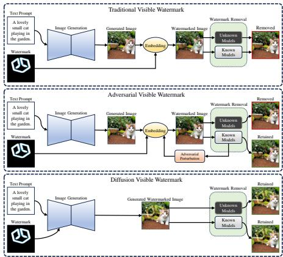
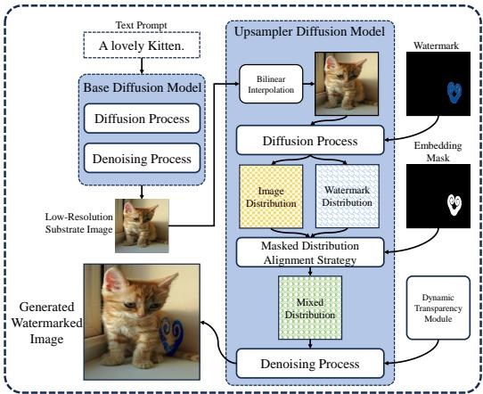
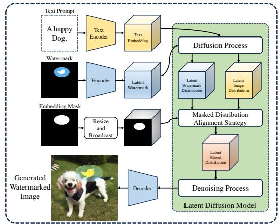
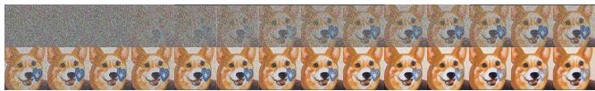
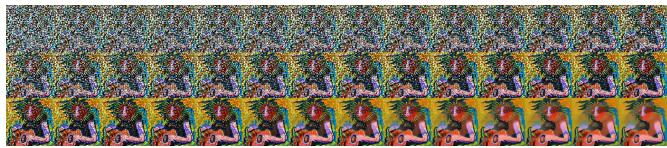
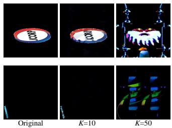
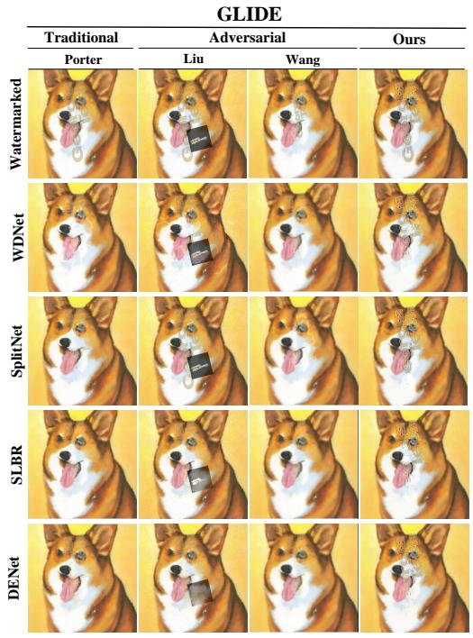
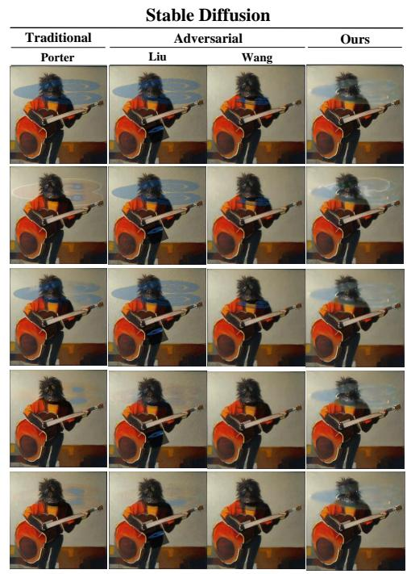
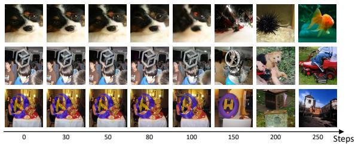

Latest updates: hps://dl.acm.org/doi/10.1145/3746027.3755687

RESEARCH-ARTICLE

# DVW: Diffusion Visible Watermark

JIAWEI ZHANG, Chongqing University of Posts and Telecommunications, Chongqing, Chongqing, China

XIAOLI JIANG, Nanjing University of Information Science & Technology, Nanjing, Jiangsu, China

HAO WANG, Huaiyin Institute of Technology, Huainan, Jiangsu, China

LIN YUAN, Chongqing University of Posts and Telecommunications, Chongqing, Chongqing, China

XIANGYANG LUO

BIN MA, Qilu University of Technology, Jinan, Shandong, China

View all

Open Access Support provided by:

Chongqing University of Posts and Telecommunications

Qilu University of Technology

Huaiyin Institute of Technology

Nanjing University of Information Science & Technology

Nankai University

PDF Download

3746027.3755687.pdf

19 January 2026

Total Citations: 0

Total Downloads: 151

Published: 27 October 2025

Citation in BibTeX format

MM '25: The 33rd ACM International Conference on Multimedia

October 27 - 31, 2025

Dublin, Ireland

Conference Sponsors: SIGMM

# DVW: Diffusion Visible Watermark

Jiawei Zhang∗

zhangjw@cqupt.edu.com

Chongqing University of Posts and

Telecommunications

Nanan, Chongqing, China

Lin Yuan

yuanlin@cqupt.edu.cn

Chongqing University of Posts and

Telecommunications

Nanan, Chongqing, China

Xiaoli Jiang∗

jiangxl1020@163.com

Nanjing University of Information

Science and Technology

Nanjing, Jiangsu, China

Xiangyang Luo†

luoxy_ieu@sina.com

State Key Laboratory of Mathematical

Engineering and Advanced

Computing

Zhengzhou, Henan, China

Jinwei Wang†

wjwei_2004@163.com

Nankai University

Nankai, Tianjin, China

Hao Wang

hywh95@hyit.edu.cn

Huaiyin Institute of Technology

Huaian, Jiangsu, China

Bin Ma

sddxmb@126.com

Qilu University of Technology

Jinan, Shandong, China

# Abstract

With the rapid development of the diffusion models, numerous exquisitely generated images have significantly increased the risk of image misuse and abuse. Despite various AI parties and companies having devoted themselves to embedding watermarks into the generated images to curb the potential detriments, the isolated embedding from the generation process makes the watermarks vulnerable to watermark removal networks. To address this issue, we propose a novel generative image watermark scheme, dubbed Diffusion Visible Watermark (DVW), which can generate watermarked images in one step without additional training or fine-tuning of the diffusion models. Specifically, DVW introduces a masked distribution alignment strategy to fuse the watermark distribution with a Gaussian noise distribution. By iterative denoising the fused aligned distribution with the pretraining diffusion models, the watermarked images with coordinated and unified distribution can be generated with natural robustness against removal. In addition, we design and integrate a dynamic transparency module to adaptively control the watermark coverage degree for better visual quality. Comprehensive experiments and analysis are conducted on two representative kinds of diffusion models, GLIDE and StableDiffusion, to prove the superior and generic robustness of our DVW against watermark removal without sacrificing the generation ability of the diffusion models.

# CCS Concepts

• Computing methodologies Computer vision problems;   
• Security and privacy Social aspects of security and privacy.

# Keywords

Visible Watermark, Visible Waermark Removal, Diffusion Model

# ACM Reference Format:

Jiawei Zhang, Xiaoli Jiang, Hao Wang, Lin Yuan, Xiangyang Luo, Bin Ma, and Jinwei Wang. 2025. DVW: Diffusion Visible Watermark. In Proceedings of the 33rd ACM International Conference on Multimedia (MM ’25), October 27–31, 2025, Dublin, Ireland. ACM, New York, NY, USA, 9 pages. https: //doi.org/10.1145/3746027.3755687

# 1 Introduction

With the continuous advancement of deep learning, diffusion models have rapidly dominated the image generation field by producing highly realistic and diverse visual content[5][7][27][28][32]. Meanwhile, the misuse of such models introduces significant concerns across economic, political, and social domains[1][2][9][10]. In response, AI companies have explored mechanisms to identify synthetic images, including the integration of visible watermarks as immediate visual cues. For instance, OpenAI incorporates visible watermark into DALL·E outputs, and DALL·E 3 embeds a C2PAcompliant watermark in the upper-left corner[23], aiming to raise user awareness regarding image authenticity.

However, most of these watermarks are independently embedded after the image generation process via traditional manners, which results in an obvious boundary and a great distribution difference between the watermark and the generated images. As shown in Figure 1, such inconsistencies make visible watermarks susceptible to removal by dedicated networks, which can easily capture the difference and further erase these visible watermarks. As a plausible and practical exploration, some researchers [33][18][13] propose adversarial watermark techniques to improve the robustness against

  
Figure 1: The visualization of different visible watermark techniques. Traditional visible watermarks and adversarial visible watermarks have to embed the watermarks after the image generation. In comparison, our DVW is free from the embedding process by directly generating watermarked images, which shows superior and generic robustness against known and unknown watermark removal networks.

removal. For example, Wang ???? ????. [33] designed an adversarial visible watermark based on the region of interest, which incorporates adversarial perturbations to prevent the watermark from being removed. Nevertheless, due to the poor transferability caused by optimization for one specific target watermark removal network, as shown in Figure 1, the adversarial watermark can hardly maintain satisfactory robustness against unknown watermark removal networks.

To address this issue, in this paper, we propose a novel generative image watermark scheme, dubbed Diffusion Visible Watermark (DVW), to achieve generic robustness against various watermark removal networks. Based on the insight that existing watermark removal networks take the distribution difference and boundary effect as a prominent basis for erasing the watermark, we aim to unify the distribution difference and eliminate the boundary effect between the watermark and the generated images. Unlike existing techniques that treat visible watermark embedding as a secondary step after image generation, the proposed DVW explores a one-step generation framework for constructing inborn watermarked images without need for additional training or fine-tuning of the diffusion models. Inborn watermarked images mean that the watermarks are generated together with the images, which can coordinate and unify the distribution of the watermarked images and show no boundary effect either. Thus, natural and generic robustness against various watermark removal networks can be obtained through our DVW.

Given the emergence of numerous diffusion model variants[16] [21][25][26][30], we select GLIDE[21] and Stable Diffusion[26]—two representative diffusion models—as the backbone of our DVW framework to ensure its effectiveness and adaptability. Specifically, GLIDE is a pixel-level diffusion model that learns to directly refine the noise into an image by a denoising process guided by text embeddings. In comparison, Stable Diffusion is a latent-level diffusion model that uses an encoder-decoder architecture to transform

images into a lower-dimensional latent space before the diffusion and denoising process. Thus, to be compatible with different diffusion levels, we introduce a masked distribution alignment strategy, which can be easily switched between pixel-level GLIDE and latentlevel Stable Diffusion.

For GLIDE, this strategy first transforms the watermark into watermark distribution, and exploits the embedding mask to determine the distribution alignment and fusion means of different regions. In detail, within the embedding region, the watermark distribution is mixed with the generated image distribution by element-wise addition, while other regions only maintain the generated image distribution. For Stable Diffusion, encoding and decoding are performed on watermarks for alignment in the low-dimensional latent space. It is worth noting that, rather than encoding the embedding mask to obtain the low-dimensional representation, we directly resize and broadcast the embedding mask to match the dimension of the watermark distribution and image distribution in the latent space for performing the distribution fusion. This is because the encoder designed for high-dimensional images would confuse the embedding mask, which only consists of binary digits.

Moreover, to realize the adaptive control of watermark transparency on the generated image, we design and integrate a dynamic transparency module based on the characteristics of the human vision system. During the last several sampling steps, a watermark visible function is calculated according to the texture and contrast complexity of the generated image to adjust the weight of each component within the mixed distribution.

Unlike existing diffusion-based watermarking methods[8][35][34] that focus on invisible watermarks, we propose a visible watermarking strategy that ensures immediate ownership recognition without requiring external extraction. While models like DALL·E and DALL·E 3 use small, fixed-position watermarks, these are easily removed through cropping or inpainting. In contrast, our approach embeds the watermark directly within the image content, making removal significantly more challenging. Furthermore, our adaptive transparency mechanism balances visibility and usability, allowing for flexible watermark prominence based on different use cases. To summarize, the main contributions are listed as follows:

• We propose a novel generative image watermark scheme, Diffusion Visible Watermark (DVW), capable of generating inborn watermarked images in one step without additional training or fine-tuning of the diffusion models.   
• For pixel-level and latent-level diffusion models, we introduce a masked distribution alignment strategy to fuse the watermark distribution with the image distribution, which coordinates and unifies the distribution of the generated watermarked images.   
• Experimental results demonstrate the effectiveness of the proposed DVW, showing superior and generic robustness against various watermark removal networks without sacrificing the generation ability of the diffusion models.

# 2 Background

# 2.1 Diffusion Model

The diffusion model is one kind of generative model that has demonstrated state-of-the-art (SOTA) performance in the field of image

generation. With the development of the diffusion model, two common sampling strategies have emerged within this class, which are Denoising Diffusion Probabilistic Model (DDPM)[11] and Denoising Diffusion Implicit Model (DDIM)[29].

DDPM aims to learn the data distribution of the given training set. By sampling a random noise vector $x _ { t }$ , DDPM can progressively denoise it to yield a high-quality image $x _ { 0 }$ . During training, DDPM defines a forward diffusion process that gradually adds Gaussian noise to the original image $x _ { 0 }$ over $T$ time steps, resulting in a noisy image $\boldsymbol { x } _ { t } \sim \boldsymbol { N } ( 0 , 1 )$ , which can be defined as:

$$
q \left(x _ {t} \mid x _ {t - 1}\right) = \mathcal {N} \left(x _ {t}; \sqrt {1 - \beta_ {t}} x _ {t - 1}, \beta_ {t} I\right), \tag {1}
$$

where $\beta _ { t }$ is the variance of the Gaussian noise added at time step ??. The denoising process predicts the mean value $\mu _ { \theta } ( x _ { t } , t )$ and variance $\Sigma _ { \theta } ( x _ { t } , t )$ of the Gaussian distribution by a deep neural network (e.g., Unet), which can be defined as:

$$
p _ {\theta} (x _ {t - 1} | x _ {t}) = \mathcal {N} (x _ {t - 1}; \mu_ {\theta} (x _ {t}, t), \Sigma_ {\theta} (x _ {t}, t)). \tag {2}
$$

Nichol ???? ???? . [22] further extended this framework by incorporating the calculation of the variance $\Sigma _ { \theta } ( x _ { t } , t )$ to significantly reduce sampling steps. During training, the variance is calculated as $\begin{array} { r } { \bar { \alpha } _ { t } = \prod _ { s = 1 } ^ { t } ( 1 - \beta _ { s } ) } \end{array}$ , allowing us to rewrite the forward process as:

$$
q (x _ {t} | x _ {0}) = \mathcal {N} (x _ {t}; \sqrt {\bar {\alpha} _ {t}} x _ {0}, (1 - \bar {\alpha} _ {t}) I), \tag {3}
$$

which facilitates efficient sampling.

DDIM, derived from DDPM, eliminates the Markov chain constraint and introduces deterministic sampling via a non-Markovian forward process, which can be defined as:

$$
\begin{array}{l} q \left(x _ {t - 1} \mid x _ {t}, x _ {0}\right) = \mathcal {N} \left(x _ {t - 1}; \sqrt {\bar {\alpha} _ {t - 1}} x _ {0} + \sqrt {1 - \bar {\alpha} _ {t - 1} - \sigma_ {t} ^ {2}} \cdot \frac {x _ {t} - \sqrt {\bar {\alpha} _ {t}} x _ {0}}{\sqrt {1 - \bar {\alpha} _ {t}}}, \sigma_ {t} ^ {2} I\right), \tag {4} \\ \sigma_ {t} = \eta \sqrt {\frac {1 - \bar {\alpha} _ {t - 1}}{1 - \bar {\alpha} _ {t}} \cdot \frac {1 - \bar {\alpha} _ {t} / \bar {\alpha} _ {t - 1}}{\bar {\alpha} _ {t}}}. \\ \end{array}
$$

If $\eta = 0$ , the sampling process is deterministic. If $\eta = 1$ , it reverts to a stochastic process equivalent to DDPM.

# 2.2 Traditional Visible Watermark

Traditional visible watermarking has been widely used to protect intellectual property and assert ownership of digital content, particularly in images and videos. Early methods, dating back to the 1990s[3], involved embedding a visible watermark that was clearly perceptible, typically placed in corners or other unobtrusive areas of the image. These watermarks aimed to deter unauthorized use by providing a visible indication of ownership.

Nowadays, a commonly used technique for visible watermark embedding is based on alpha blending proposed by Porter ???? ????. [24], which can be defined as:

$$
\begin{array}{l} X (p) = m (p) \cdot \left[ (1 - \alpha (p)) C (p) + \alpha (p) W (p) \right] \\ + (1 - m (p)) \cdot C (p). \tag {5} \\ \end{array}
$$

where $\boldsymbol { p } = ( i , j )$ represents the pixel location, $\alpha ( p )$ denotes the transparency level, allowing both the cover image $C ( \boldsymbol { p } )$ and watermark $W ( p )$ to remain clear in the watermark area. $m ( p )$ represents the watermark mask, which focuses the watermarking process on specific areas of the image. Without special instructions, traditional visible watermark denotes alpha blending in the following paper.

# 2.3 Visible Watermarking Removal

With the development of deep neural networks, watermark removal techniques have emerged and advanced rapidly, which can erase the embedded watermark within the images according to the great distribution difference between the watermark and the host images. The existing methods can be categorized into end-to-end full-image erasure and two-stage removal. The first approach[4][15] treats watermark removal as an image translation problem, where a watermarked image is mapped to a watermark-free target image using popular image translation models. However, this method implicitly guides the model in identifying the watermark region, which can lead to accidental erasure of the image content. The second approach adopts a multi-task learning framework[6][17][19][31], dividing the task into two stages: watermark localization and subsequent image reconstruction to remove the watermark. Due to its greatly reduction in the risk of accidental erasure, the two-stage approach has become the mainstream solution for watermark removal.

# 2.4 Adversarial Visible Watermark

Given the threats mentioned above, researchers have explored adversarial examples with visible watermarks to improve the robustness of the watermark. For example, Liu ???? ???? . [18] introduced the concept of watermark vaccines, which add imperceptible adversarial perturbations to the watermarked image to actively disrupt watermark removal networks, demonstrating effective prevention of watermark removal. Similarly, Wang et al. [33] proposed using Gard-CAM $^ { + + }$ to identify the optimal watermark embedding regions. They also added adversarial perturbations to enhance the robustness of the watermark. However, due to the poor transferability, these adversarial visible watermarks only achieve good robustness against known specific visible watermark removal network and cannot maintain satisfactory performance to the unknown networks[36]. This defect severely limits their usability in practical scenarios. Thus, in this paper, we aim to develop a novel visible watermark, which can achieve superior and generic robustness against both known and unknown watermark removal networks.

# 2.5 Diffusion Invisible Watermark

In addition to visible watermarking, several recent works have focused on embedding invisible watermarks directly into diffusion models [20]. Xiong et al. [34] proposed an end-to-end framework that embeds dynamically changeable messages into latent diffusion models by fusing a message matrix with intermediate features, enabling flexible and secure watermarking without retraining. Fernández et al. [8] introduced Stable Signature, which fine-tunes diffusion models to embed binary signatures that remain detectable even after aggressive post-processing. Gaussian Shading [35] presents a plug-and-play method that embeds imperceptible signals into Gaussian latent representations with provable indistinguishability, using DDIM-based sampling and inversion for embedding and extraction, while exhibiting robustness against lossy transformations. While invisible watermarking is well suited for provenance tracing, visible watermarks remain more effective in scenarios that demand immediate interpretability, such as content moderation or platform-level disclosure. Our work addresses this practical need

  
DVW for GLIDE

  
DVW for Stable Diffusion   
Figure 2: The framework of the proposed DVW for pixel-level diffusion model GLIDE and latent-level diffusion model Stable Diffusion.

  
Figure 3: GLIDE text2img task $T _ { 2 7 } \sim T _ { 0 }$ process of generating watermarked images.

by integrating visible watermarking directly into the generative process of diffusion models.

# 3 The Proposed Method

# 3.1 Overview

As shown in Figure 2, we propose a novel generative image watermark scheme for diffusion models, called Diffusion Visible Watermark (DVW), which exhibits strong and general robustness against various watermark removal networks. DVW employs a masked distribution alignment strategy to fuse the watermark distribution with the image distribution, which can coordinate and unify the distribution of the generated watermarked images. Moreover, for compatibility with various diffusion models, the proposed strategy can easily switch between different diffusion levels. Specifically, for pixel-level GLIDE, this strategy first transforms the watermark into watermark distribution, and exploits the embedding mask to determine the distribution alignment and fusion means of different regions. For latent-level Stable Diffusion, the watermark is encoded into the latent representation before the denoising and fusion process. With the proposed DVW, inborn watermark images can be generated by diffusion models in one step, acting as reliable provenance indicators for diffusion-generated content.

# 3.2 Masked Distribution Alignment Strategy

The masked distribution alignment strategy aims to fuse the watermark distribution with the image distribution, ensuring that the generated watermarked image maintains a coordinated and unified distribution. Compared to natural images, generated images often contain more high-frequency components and exhibit

smoother spatial variations due to their nature as samples drawn from training data distributions[12][14]. As a result, generated images typically lack the intricate and irregular details present in natural images. Directly embedding visible watermarks using traditional or adversarial schemes often results in noticeable boundaries and significant distributional discrepancies between the watermark and the generated image. These boundary and distributional artifacts can be easily exploited by watermark removal networks to localize and subsequently erase the embedded watermark. Based on these insights, we are enlightened to mix the watermark and the host image at the distribution level, enabling the generation of inborn watermarked images.

Diving into the generation process, we observe that diffusion models learn data distributions by iteratively noising and denoising the images, making noisy intermediate image distribution ideal carriers for visible watermarks. Building on this observation, we design a novel approach that incorporates watermark embedding directly into the image generation pipeline. This integration makes the watermark an inherent component of end-to-end image generation. To avoid introducing significant distributional shifts that might arise from forcefully altering the generative data during denoising steps, we introduce a masked distribution alignment strategy to ensure that the watermark and host image are harmoniously generated. In this context, the visible watermarking task is treated as a conditional operation based on the embedding mask, where the watermark content is overlaid with the background content within the masked region, while the unmasked region remains consistent with the host image. According to Equation 2, each reverse step from $x _ { t }$ to $x _ { t - 1 }$ within diffusion models relies on $x _ { t }$ . Therefore,the internal content of the host image can be modified, provided that its distributional properties remain intact. This ensures that the watermark embedding does not disrupt the capacity of the generative models to produce high-quality images. Consequently, the watermark is seamlessly integrated, preserving both its visibility and the structural integrity of the image.

Since the forward process follows a Markov chain of Gaussian noise additions (Equation 1), we transform $x _ { t - 1 } ^ { w a t e r m a r k }$ into forward

parameters aligned with the distribution of $x _ { t - 1 } ^ { c o v e r }$ and jointly sample the intermediate image $x _ { t }$ at any given timestep via Equation 6. Here, $x ^ { c o v e r }$ denotes the host image, ???????????????????? represents the watermark image, and $m \odot x _ { t - 1 } ^ { c o v e r }$ denotes a watermark-free image, while $m \odot ( x _ { t - 1 } ^ { c o v e r } + x _ { t - 1 } ^ { w a t }$ ???????????? ) represents a masked watermarked image. This approach helps the embedded watermark remain imperceptible to existing removal networks, thereby enhancing its integrity and robustness during the generation process.

Pixel values in non-watermark region are generated through standard denoising of the host image $x _ { t - 1 } ^ { c o v e r }$ , while those in the watermark region are iteratively denoised based on the distribution of both the host image and the watermark. Specifically, we define the new denoising process as follows:

$$
x _ {t - 1} = m \odot \left(x _ {t - 1} ^ {\text {c o v e r}} + x _ {t - 1} ^ {\text {w a t e r m a r k}}\right) + (1 - m) \odot x _ {t - 1} ^ {\text {c o v e r}}, \tag {6}
$$

where

$$
x _ {t - 1} ^ {\text {c o v e r}} \sim \mathcal {N} (\sqrt {\bar {\alpha} _ {t}} x _ {0} ^ {\text {c o v e r}}, (1 - \bar {\alpha} _ {t}) \mathbf {I}), \tag {7}
$$

and

$$
x _ {t - 1} ^ {\text {w a t e r m a r k}} \sim \mathcal {N} (\sqrt {\bar {\alpha} _ {t}} x _ {0} ^ {\text {w a t e r m a r k}}, (1 - \bar {\alpha} _ {t}) \mathrm {I}). \tag {8}
$$

?? denotes the embedding mask that controls the fusion of the watermark and host image, $\odot$ represents the element-wise multiplication operation, and $x _ { t - 1 }$ is the resulting image with a naturally integrated watermark. This ensures that the watermark is harmoniously blended with the host image, yielding an inborn watermarked generated image $x _ { t - 1 }$ .

# 3.3 DVW for Pixel-Level GLIDE

For pixel-level diffusion models, we take GLIDE as an example, with the generative watermarking scheme illustrated in the left part of Figure 2. GLIDE first utilizes DDPM to generate a low-resolution substrate image of size $6 4 { \times } 6 4$ based on a given text prompt over 100 steps. The substrate image is then upsampled using bilinear interpolation within an upsampler diffusion model, where DDIM is applied for fast sampling over 27 steps to produce high-resolution images with sizes of $2 5 6 \times 2 5 6$ , $5 1 2 \times 5 1 2$ , or even $1 0 2 4 \times 1 0 2 4$ .

To craft an inborn watermarked generated image, the proposed DVW embeds the watermark during the upsampler diffusion stage within a unified pipeline. Specifically, after the low-resolution substrate image is upsampled to the same size as the watermark, the diffusion operation is performed on both the substrate image and watermark to obtain the distributions of the image and watermark, respectively. Then, the image and watermark distributions are fused to craft a mixed distribution under the proposed masked distribution alignment strategy, guided by the embedding mask. Next, the denoising process is performed on the mixed distribution to yield a generated watermarked image. The visualization results are shown in Figure 3.

It is worth noting that the GLIDE performs diffusion and denoising processes at the pixel level, enabling adaptive control of watermark transparency based on the neighborhood pixel complexity. Based on the existing study of the characteristic of human vision, we integrate a dynamic transparency module into the standard denoising process, defined as:

$$
x _ {t - 1} = m \odot \left(x _ {t - 1} ^ {\text {c o v e r}} \cdot (1 - \beta) + x _ {t - 1} ^ {\text {w a t e r m a r k}} \cdot \beta\right) + (1 - m) \odot x _ {t - 1} ^ {\text {c o v e r}}, \tag {9}
$$

  
Figure 4: Stable Diffusion text2img task $T _ { 5 0 } \sim T _ { 0 }$ process of generating watermarked images (ignore $T _ { 9 } \sim T _ { 1 }$ ) .

  
Figure 5: The influence of the number of noise added to the watermark on the reconstruction of the watermark. ?? represents the number of noise addition steps.

where $\beta$ is calculated by a watermark visible function, which can be defined as:

$$
\beta = \gamma_ {1} \cdot \operatorname {s i g m o i d} \left(\frac {\bar {\sigma} _ {x} ^ {2}}{\bar {\sigma} _ {x} ^ {2} + \sigma_ {x} ^ {2}}\right) + \gamma_ {2}. \tag {10}
$$

?????????????? (·) represents the sigmoid activation function, which maps the texture complexity $\frac { { \bar { \sigma } } _ { x } ^ { 2 } } { { \bar { \sigma } } _ { x } ^ { 2 } + { \sigma } _ { x } ^ { 2 } }$ into the range [0,1]. $\frac { { \bar { \sigma } } _ { x } ^ { 2 } } { { \bar { \sigma } } _ { x } ^ { 2 } + { \sigma } _ { x } ^ { 2 } }$ calculate neighborhood pixel complexity by mean variance $\bar { \sigma } _ { x } ^ { 2 }$ and variance $\sigma _ { x } ^ { 2 }$ . To match the typical transparency levels of common visible watermarks and the watermarks in the CLWD dataset, we further constrain the range of $\beta$ to [0.3,0.7] by setting $\gamma _ { 1 } { = } 0 . 4$ and $\gamma _ { 2 } { = } 0 . 3$ . The algorithm of DVW for GLIDE is demonstrated in the Appendix.

# 3.4 DVW for Latent-Level Stable Diffusion

For latent-level diffusion models, we take Stable Diffusion as an example, with the generative watermarking scheme illustrated in the right part of Figure 2. Latent-level diffusion models shift pixellevel operations into latent space through encoding and decoding processes. As a result, directly applying the masked distribution alignment to fuse a pixel-level watermark distribution with a latentlevel image distribution becomes infeasible, since a small latent patch typically corresponds to a large region in pixel space. Thus, it is necessary to transform the watermark image into latent space, align it with the latent variables of the generated image, and complete the distribution fusion in latent space.

Specifically, we feed the watermark into the encoder of Stable Diffusion to obtain its corresponding latent representation. Then, we perform a diffusion process on the latent watermark and the text embedding formed by the text prompt, yielding the latent watermark distribution and the latent image distribution, respectively. Next, the latent watermark distribution and latent image distribution are fused to obtain a latent mixed distribution, which would

undergo a denoising process and decoder to produce a watermarked generated image. The visualization results are shown in Figure 4.

As shown in Figure 5, it is worth noting that applying too many noise steps during diffusion may distort the watermark. In such cases, the reconstructed watermark can deviate significantly from its predefined appearance. On the other hand, too few noise steps may not eliminate the distribution difference of the watermark, further damaging the fusing effectiveness and robustness against watermark removal. In the following experiments, we empirically observe the effects of the noise step of the watermark $K$ and suggest setting $K \ < \ 1 0$ . The algorithm of DVW for Stable Diffusion is demonstrated in Appendix.

# 4 Experiments

# 4.1 Experimental Setup

Implementation Details. To ensure a fair comparison, all experiments were conducted on a single NVIDIA GeForce GTX 2080 Ti and implemented using PyTorch.The watermark embedding parameters based on the Colored Large-scale Watermark Dataset (CLWD) [17].

Dataset. Our experiments reconstruct the CLWD, which comprises three parts: non-watermarked images, watermark images, and watermarked images. We utilized the methods mentioned in Section 3 to generate the watermarked image based on CLWD. In addition, we constructed a generated image dataset using GLIDE and Stable Diffusion. The GLIDE portion includes images from three generation tasks: text-to-image generation, CLIP-guided generation, and image inpainting. For Stable Diffusion, we adopt version 1.1 for text-to-image generation. Each prompt in our dataset corresponds to two generated images: (1) a watermarked image generated using our proposed method and (2) a non-watermarked image generated under identical conditions. The non-watermarked images serve as a reference for second-stage embedding strategy in comparative experiments.

Model Architecture. We adopt four advanced visible watermark removal networks: WDNet [19], SplitNet [6], SLBR[17], and DENet [31]. All models were trained on watermark samples from the CLWD dataset. The best-performing checkpoints were saved and subsequently used to evaluate their performance on both the reconstructed CLWD dataset and the GLIDE- and Stable Diffusiongenerated images.

Evaluation Metrics. Following previous work [6][17][19][31], we adopted Peak Signal-to-Noise Ratio (PSNR), Structural Similarity Index (SSIM), Root Mean Square Error (RMSE), Weighted Root Mean Square Error (RMSEw), and Intersection over Union (IoU) as our evaluation metrics. Detailed descriptions can be found in Appendix.

# 4.2 Comparison Experiments

To validate the proposed DVW, we conducted extensive comparison experiments across two diffusion models: GLIDE and Stable Diffusion, to evaluate the effectiveness and robustness. We also performed transparency, adaptability, and time cost experiments in Appendix.

To validate the effectiveness and robustness of our DVW, we conducted a comprehensive evaluation using three watermarking schemes as baselines: the traditional watermarking method Porter

???? ???? . [24], the adversarial watermarking scheme proposed by Liu ???? ???? . [18] and Wang ???? ???? . [33], and our DVW. Since no existing watermarking method explicitly focuses on distribution-level defenses, we selected the most widely used traditional visible watermarking method as a representative of pixel-level schemes and the latest adversarial visible watermarking approaches as state-of-the-art baselines. This selection ensures a comprehensive comparison between our diffusion-based watermarking framework and existing pixel-centric approaches. We selected 1,000 watermark images from the CLWD dataset for the text-to-image generation task in GLIDE and 3,000 watermarked images for the text-to-image generation task in Stable Diffusion. Corresponding watermark comparison schemes were applied to these datasets for evaluation.

Our method demonstrates the seamless embedding of watermarks during the image generation process, with no perceptible impact on the visual quality of the images. As shown in Tables 1 and Figure 6, the watermark is effectively integrated into the image generation pipeline, making it difficult to isolate or remove without degrading the image quality. In contrast, in order to achieve better anti-removal ability, adversarial watermarking in the two-stage scheme often brings about the problem of excessive noise affecting image quality.

Regarding robustness, we assessed the performance of the watermarked images under various watermark removal networks, including WDNet, SplitNet, SLBR and DENet. These networks represent a range of attacks from general to targeted removal techniques. As shown in the quantitative results of Tables 1 and visualization in Figure 6, the experimental results show that the traditional watermarking scheme on the generated images from GLIDE and Stable Diffusion can still be detected and removed by the watermark removal network. Traditional scheme’s IoU can reach up to $8 1 . 1 5 \%$ and $5 1 . 3 9 \%$ , indicating that the alpha hybrid watermarking scheme cannot resist the attack of the blind watermark removal network. The two kinds of anti-watermark can effectively resist the attack of the watermark removal network in white-box settings, that is, the removal of WDNet, and can defend against other watermark removal networks to a certain extent. For example, the watermark vaccine approach achieves an IoU of only $2 . 1 5 \%$ under SplitNet. However, its performance degrades under SLBR and DENet, with IoU values exceeding $2 0 \%$ , reflecting the limited transferability of adversarial samples in black-box scenarios—a well-known limitation in adversarial design.

Compared with traditional watermarks, generative watermarks generated on GLIDE can resist watermark removal to a certain extent. For example, the fourth line watermark is only partially removed in the white background image, while other background areas retain watermark traces. In the last row of the watermark removal results, only WDNet removes the watermark, and other removal schemes still leave the effect of visible watermark, which reflects the superiority of the proposed DVW. Following removal attempts by SplitNet, SLBR, and DENet, the IoU remains below $1 \%$ . Even under WDNet, the IoU is under $8 \%$ for Stable Diffusiongenerated images. Additionally, DVW consistently achieves higher PSNR and SSIM, and lower RMSE and RMSEw, confirming its strong robustness. The proposed DVW realizes the anti-removal of the watermark by binding the strong connection between the watermark and the generated content.

  
Figure 6: Comparative Evaluation of Watermarking Robustness in Text-to-Image Generation: Traditional vs. Adversarial vs. Proposed Methods on GLIDE (Prompt: A cute Shiba Inu) and Stable Diffusion (Prompt: A Painting of a Virus Monster Playing Guitar).

Table 1: Quantitative test results of generative watermarking and adversarial watermarking for watermark removal networks   

<table><tr><td rowspan="2">Methods</td><td rowspan="2">Models</td><td colspan="2">WDNet</td><td colspan="2">SplitNet</td><td>SLBR</td><td>DENet</td></tr><tr><td>PSNR↑/SSIM↑/RMSE↓/RMSEw↓/IoU↓</td><td>PSNR↑/SSIM↑/RMSE↓/RMSEw↓/IoU↓</td><td>PSNR↑/SSIM↑/RMSE↓/RMSEw↓/IoU↓</td><td>PSNR↑/SSIM↑/RMSE↓/RMSEw↓/IoU↓</td><td>PSNR↑/SSIM↑/RMSE↓/RMSEw↓/IoU↓</td><td>PSNR↑/SSIM↑/RMSE↓/RMSEW↓/IoU↓</td></tr><tr><td rowspan="2">Liu</td><td>GLIDE</td><td>26.41/0.9465/13.63/14.32/6.90%</td><td>26.97/0.9524/14.73/13.25/12.57%</td><td>27.84/0.9621/12.64/12.90/5.45%</td><td>27.98/0.9670/12.03/12.37/5.94%</td><td></td><td></td></tr><tr><td>Stable</td><td>34.99/0.9784/6.21/10.84/12.58%</td><td>47.91/0.9982/1.47/2.11/2.15%</td><td>33.82/0.9811/6.98/16.55/31.93%</td><td>32.37/0.9803/7.62/13.80/20.11%</td><td></td><td></td></tr><tr><td rowspan="2">Wang</td><td>GLIDE</td><td>29.41/0.9501/10.68/14.50/6.42%</td><td>26.47/0.9522/8.57/28.46/6.31%</td><td>31.89/0.9758/13.25/15.42/30.57%</td><td>30.72/0.9620/8.41/11.27/25.73%</td><td></td><td></td></tr><tr><td>Stable</td><td>33.83/0.9781/9.21/13.75/10.25%</td><td>39.80/0.9914/4.36/20.90/30.25%</td><td>37.90/0.9878/5.78/31.83/46.97%</td><td>33.71/0.9167/11.04/35.81/33.47%</td><td></td><td></td></tr><tr><td rowspan="2">Porter</td><td>GLIDE</td><td>29.49/0.9439/9.69/38.05/51.33%</td><td>41.59/0.9894/3.52/12.29/22.26%</td><td>31.37/0.9620/8.34/36.16/81.15%</td><td>36.06/0.9800/7.25/26.27/37.28%</td><td></td><td></td></tr><tr><td>Stable</td><td>28.94/0.9457/9.97/26.63/34.77%</td><td>39.38/0.9886/4.03/12.40/22.00%</td><td>31.70/0.9751/7.73/29.01/51.39%</td><td>34.69/0.9801/6.04/18.32/35.97%</td><td></td><td></td></tr><tr><td rowspan="2">Ours</td><td>GLIDE</td><td>32.14/0.9720/7.51/21.26/26.52%</td><td>47.97/0.9974/1.79/4.73/5.45%</td><td>41.79/0.9866/5.25/18.77/26.56%</td><td>40.33/0.9901/4.60/14.77/19.18%</td><td></td><td></td></tr><tr><td>Stable</td><td>31.27/0.9653/7.80/8.57/7.43%</td><td>45.81/0.9966/2.22/1.81/0.86%</td><td>42.97/0.9961/2.39/1.53/0.89%</td><td>43.36/0.9957/2.47/2.19/1.64%</td><td></td><td></td></tr></table>

Table 2: Ablation Study on the CLWD Dataset Using DDPM   

<table><tr><td rowspan="2">Removal Method Metrics</td><td colspan="3">WDNet</td><td colspan="3">SplitNet</td><td colspan="3">SLBR</td><td colspan="3">DENet</td></tr><tr><td>†CLWD</td><td>‡w/o DVM</td><td>§Ours</td><td>†CLWD</td><td>‡w/o DVM</td><td>§Ours</td><td>†CLWD</td><td>‡w/o DVM</td><td>§Ours</td><td>†CLWD</td><td>‡w/o DVM</td><td>§Ours</td></tr><tr><td>PSNR ↑</td><td>27.68</td><td>26.89</td><td>28.52</td><td>28.43</td><td>28.35</td><td>29.11</td><td>29.89</td><td>29.43</td><td>29.70</td><td>31.28</td><td>30.36</td><td>31.43</td></tr><tr><td>SSIM ↑</td><td>0.9401</td><td>0.9414</td><td>0.9445</td><td>0.9537</td><td>0.9511</td><td>0.9565</td><td>0.9587</td><td>0.9573</td><td>0.9602</td><td>0.9740</td><td>0.9596</td><td>0.9573</td></tr><tr><td>RMSE ↓</td><td>12.60</td><td>13.86</td><td>11.74</td><td>12.69</td><td>13.36</td><td>10.87</td><td>11.04</td><td>12.39</td><td>11.43</td><td>4.89</td><td>7.65</td><td>7.68</td></tr><tr><td>RMSEw ↓</td><td>46.11</td><td>53.23</td><td>46.29</td><td>48.38</td><td>50.15</td><td>36.01</td><td>43.27</td><td>50.37</td><td>45.34</td><td>18.22</td><td>29.71</td><td>27.99</td></tr><tr><td>IoU ↓</td><td>67.78%</td><td>60.93%</td><td>52.61%</td><td>76.89%</td><td>69.83%</td><td>58.84%</td><td>85.48%</td><td>74.83%</td><td>66.28%</td><td>78.88%</td><td>64.58%</td><td>60.85%</td></tr></table>

† CLWD refers to the results obtained by removing data from the original CLWD training set.   
‡ w/o DVM refers to the results of the DVW without Dynamic Transparency Module.   
§ Ours refers to the results of the whole DVW.

Unlike existing watermarking approaches, which are primarily designed to combat pixel-level removal techniques, our method introduces distribution-level defenses, making conventional watermark removal strategies significantly less effective. By binding

the strong connection between the watermark and the generated content, DVW achieves superior robustness, ensuring watermark persistence even under aggressive removal attacks. It is worth noting that architecture also has an impact on the robustness. This

is because Stable Diffusion is latent-based, which encodes both image and watermark in a compressed, latent space, making the fusion more inseparable and the removal more difficult compared to pixel-based GLIDE.

# 4.3 Performance Under Diffusion-Based Attack

Beyond traditional pixel-level removal attacks, we further evaluate the robustness of DVW under a generative erasure scenario based on the diffusion process itself. This attack simulates a secondgeneration threat where an adversary seeks to remove the visible watermark not through targeted editing, but by reintroducing the watermarked image into a diffusion model to regenerate a "clean" image. Specifically, we perform a denoising-based attack using the same DDPM model, applying a forward noising process followed by reverse sampling to reconstruct images at various noise levels.

In our setup, we add noise to the watermarked image at diffusion steps $t = \{ 0 , 3 0 , 5 0 , 8 0 , 1 0 0 , 1 5 0 , 2 0 0 , 2 5 0 \}$ , where $t = 0$ denotes the original image and $t = 2 5 0$ corresponds to full diffusion into Gaussian noise followed by random sampling. We then apply the standard denoising process to obtain re-synthesized images. The qualitative results are visualized in Figure 7.

We observe that DVW’s watermark remains partially visible when the noising level is low $\left( t \leq 5 0 \right)$ ), although its fine-grained details begin to fade. At moderate noise levels $\dot { t } = 8 0$ to 100), the watermark is largely eliminated, along with high-frequency image textures, and only structural outlines of the original image remain. Once $t \geq 1 5 0$ , the regenerated images diverge significantly from the originals, showing semantic inconsistencies and perceptual distortions, indicating that both watermark and original content have been lost and the generation is dominated by randomness.

  
Figure 7: Visualization of re-denoising attack results on DVW watermarked images using DDPM. Each column corresponds to a denoising step ?? during the diffusion process $( t = 0$ to $t = 2 5 0$ ), where higher steps indicate deeper noising before reverse sampling. The images show how watermark visibility and image semantics degrade progressively with increased diffusion steps.

# 4.4 Ablation Experiment

In this experiment, we demonstrated the effectiveness of the masked distribution alignment strategy and dynamic transparency module. Furthermore, we also evaluated the effectiveness of watermark combination strategy, watermark constructed times and the effect of watermark addition in Appendix.

To assess the effectiveness of the masked distribution alignment strategy and dynamic transparency module, we utilized the DDPM

sampling method to generate 60,000 watermarked images from the CLWD training set. Both the original non-watermarked images and watermark templates were used as input. The original watermarked images from CLWD served as a baseline for comparison. To evaluate robustness, we applied multiple watermark removal networks to both the generated watermarked images and the baseline images for a comprehensive attack assessment. During the experiment, we controlled the watermark transparency within the range of [0.3, 0.7]. The generated outputs were then compared against the original CLWD training images. The results of watermark removal attacks on the original CLWD images, images reconstructed without dynamic transparency module, and images reconstructed by DVW are shown in Table 2. The experimental results indicate that the PSNR and SSIM values decrease after watermark removal when the masked distribution alignment strategy is used, while RMSE and $\mathrm { R M S E } _ { w }$ increase, and the IoU decreases by at least $7 \%$ These results suggest that the strategy promotes stronger coherence between the watermark and image content, leading to seamless integration throughout the denoising trajectory. However, due to the inability of the watermark removal network to accurately locate the watermark regions, it erroneously removes other areas, resulting in a decrease in IoU. Although PSNR and SSIM did not improve, the changes in RMSE and $\mathrm { R M S E } _ { w }$ also reflect the capability of the diffusion model in faithful image reconstruction, with the watermark removal network effectively learning the details of both the watermark and the host image for effective removal.

Furthermore, the robustness of watermark is also improved by the proposed dynamic transparency module, which reduced the IoU by at least $1 5 \%$ . This approach not only enhances resistance to removal attacks but also enables adaptive adjustment of watermark transparency based on image content. The introduced randomness, while preserving visual quality, further prevents precise localization and removal by existing networks.

# 5 Conclusion

In this paper, we propose a novel generative image watermark scheme, termed Diffusion Visible Watermark (DVW), which enables the generation of inborn watermarked images during the image generation process of diffusion models. By leveraging a masked distribution alignment strategy, DVW achieves a coordinated and unified distribution between the watermark and the generated content, resulting in superior robustness against various watermark removal networks under black-box scenarios. Moreover, the proposed DVW is highly modular and can be easily deployed for different diffusion models without additional training or fine-tuning. DVW has the potential to serve as a reliable visual identifier for synthetic content, encouraging greater public awareness of image authenticity and provenance.

In future work, we aim to enhance the robustness of DVW against manual removal methods, such as those performed using professional image editing tools (e.g., Photoshop). Additionally, we will explore content-aware and context-adaptive embedding techniques to further improve the robustness, flexibility, and practicality of DVW across diverse deployment scenarios.

Acknowledgements: This work is supported by National Natural Science Foundation of China (Grants No.62472229, U24B20179,

U23A20305, U23B2022, 62371145, 62272255, 62302248), the National Key Rand D Program of China (Grants No.2021QY0700), Zhongyuan Science and Technology Innovation Leading Talent Project of China (Grants No.214200510019), the Open Project the State Key Laboratory of Tibetan Intelligent Information Processing and Application (Key Laboratory of Tibetan information processing, Ministry of Education) (Grants No.2024-Z-003) and Natural Science Foundation of Chongqing (CSTB2022NSCQ-MSX1265).

# References

[1] Markus Appel and Fabian Prietzel. 2022. The detection of political deepfakes. Journal of Computer-Mediated Communication 27, 4 (2022), zmac008.   
[2] Charlotte Bird, Eddie Ungless, and Atoosa Kasirzadeh. 2023. Typology of Risks of Generative Text-to-Image Models. In Proceedings of the 2023 AAAI/ACM Conference on AI, Ethics, and Society (Montréal, QC, Canada) (AIES ’23). Association for Computing Machinery, New York, NY, USA, 396–410. https: //doi.org/10.1145/3600211.3604722   
[3] Gordon W Braudaway. 1997. Protecting publicly-available images with an invisible image watermark. In Proceedings of international conference on image processing, Vol. 1. IEEE, 524–527.   
[4] Zhiyi Cao, Shaozhang Niu, Jiwei Zhang, and Xinyi Wang. 2019. Generative adversarial networks model for visible watermark removal. IET Image Processing 13, 10 (2019), 1783–1789.   
[5] Ciprian Corneanu, Raghudeep Gadde, and Aleix M Martinez. 2024. Latentpaint: Image inpainting in latent space with diffusion models. In Proceedings of the IEEE/CVF Winter Conference on Applications of Computer Vision. 4334–4343.   
[6] Xiaodong Cun and Chi-Man Pun. 2021. Split then refine: stacked attention-guided resunets for blind single image visible watermark removal. In Proceedings of the AAAI conference on artificial intelligence, Vol. 35. 1184–1192.   
[7] Prafulla Dhariwal and Alexander Nichol. 2021. Diffusion models beat gans on image synthesis. Advances in neural information processing systems 34 (2021), 8780–8794.   
[8] Pierre Fernandez, Guillaume Couairon, Hervé Jégou, Matthijs Douze, and Teddy Furon. 2023. The stable signature: Rooting watermarks in latent diffusion models. In Proceedings of the IEEE/CVF International Conference on Computer Vision. 22466– 22477.   
[9] Joel Frank, Franziska Herbert, Jonas Ricker, Lea Schönherr, Thorsten Eisenhofer, Asja Fischer, Markus Dürmuth, and Thorsten Holz. 2024. A Representative Study on Human Detection of Artificially Generated Media Across Countries. In 2024 IEEE Symposium on Security and Privacy (SP). 55–73. https://doi.org/10.1109/ SP54263.2024.00159   
[10] Abhishek Gupta. 2022. Unstable Diffusion: Ethical Challenges and Some Ways Forward. https://montrealethics.ai/unstable-diffusion-ethical-challenges-andsome-ways-forward/. Accessed: 2025-4-12.   
[11] Jonathan Ho, Ajay Jain, and Pieter Abbeel. 2020. Denoising diffusion probabilistic models. Advances in neural information processing systems 33 (2020), 6840–6851.   
[12] Xinrong Hu, Yuxin Jin, Jinxing Liang, Junping Liu, Ruiqi Luo, Min Li, and Tao Peng. 2023. Diffusion Model for Image Generation-A Survey. In 2023 2nd International Conference on Artificial Intelligence, Human-Computer Interaction and Robotics (AIHCIR). IEEE, 416–424.   
[13] Xiaojun Jia, Xingxing Wei, Xiaochun Cao, and Xiaoguang Han. 2020. Advwatermark: A Novel Watermark Perturbation for Adversarial Examples. In Proceedings of the 28th ACM International Conference on Multimedia (Seattle, WA, USA) (MM ’20). Association for Computing Machinery, New York, NY, USA, 1579–1587. https://doi.org/10.1145/3394171.3413976   
[14] Negar Kamali, Karyn Nakamura, Angelos Chatzimparmpas, Jessica Hullman, and Matthew Groh. 2024. How to Distinguish AI-Generated Images from Authentic Photographs. arXiv preprint arXiv:2406.08651 (2024).   
[15] Xiang Li, Chan Lu, Danni Cheng, Wei-Hong Li, Mei Cao, Bo Liu, Jiechao Ma, and Wei-Shi Zheng. 2019. Towards photo-realistic visible watermark removal with conditional generative adversarial networks. In Image and Graphics: 10th International Conference, ICIG 2019, Beijing, China, August 23–25, 2019, Proceedings, Part I 10. Springer, 345–356.

[16] Yanyu Li, Huan Wang, Qing Jin, Ju Hu, Pavlo Chemerys, Yun Fu, Yanzhi Wang, Sergey Tulyakov, and Jian Ren. 2024. Snapfusion: Text-to-image diffusion model on mobile devices within two seconds. Advances in Neural Information Processing Systems 36 (2024).   
[17] Jing Liang, Li Niu, Fengjun Guo, Teng Long, and Liqing Zhang. 2021. Visible watermark removal via self-calibrated localization and background refinement. In Proceedings of the 29th ACM international conference on multimedia. 4426–4434.   
[18] Xinwei Liu, Jian Liu, Yang Bai, Jindong Gu, Tao Chen, Xiaojun Jia, and Xiaochun Cao. 2022. Watermark vaccine: Adversarial attacks to prevent watermark removal. In European Conference on Computer Vision. Springer, 1–17.   
[19] Yang Liu, Zhen Zhu, and Xiang Bai. 2021. Wdnet: Watermark-decomposition network for visible watermark removal. In Proceedings of the IEEE/CVF winter conference on applications of computer vision. 3685–3693.   
[20] Zhiyuan Ma, Guoli Jia, Biqing Qi, and Bowen Zhou. 2024. Safe-SD: Safe and Traceable Stable Diffusion with Text Prompt Trigger for Invisible Generative Watermarking. In Proceedings of the 32nd ACM International Conference on Multimedia (Melbourne VIC, Australia) (MM ’24). Association for Computing Machinery, New York, NY, USA, 7113–7122. https://doi.org/10.1145/3664647.3681418   
[21] Alex Nichol, Prafulla Dhariwal, Aditya Ramesh, Pranav Shyam, Pamela Mishkin, Bob McGrew, Ilya Sutskever, and Mark Chen. 2021. Glide: Towards photorealistic image generation and editing with text-guided diffusion models. arXiv preprint arXiv:2112.10741 (2021).   
[22] Alexander Quinn Nichol and Prafulla Dhariwal. 2021. Improved denoising diffusion probabilistic models. In International conference on machine learning. PMLR, 8162–8171.   
[23] OpenAI. 2024. C2PA in DALL·E 3. https://help.openai.com/en/articles/8912793- c2pa-in-dall-e-3. Accessed: 2025-4-12.   
[24] Thomas Porter and Tom Duff. 1984. Compositing digital images. In Proceedings of the 11th annual conference on Computer graphics and interactive techniques. 253–259.   
[25] Aditya Ramesh, Prafulla Dhariwal, Alex Nichol, Casey Chu, and Mark Chen. 2022. Hierarchical text-conditional image generation with clip latents. arXiv preprint arXiv:2204.06125 1, 2 (2022), 3.   
[26] Robin Rombach, Andreas Blattmann, Dominik Lorenz, Patrick Esser, and Björn Ommer. 2022. High-resolution image synthesis with latent diffusion models. In Proceedings of the IEEE/CVF conference on computer vision and pattern recognition. 10684–10695.   
[27] Chitwan Saharia, William Chan, Huiwen Chang, Chris Lee, Jonathan Ho, Tim Salimans, David Fleet, and Mohammad Norouzi. 2022. Palette: Image-to-image diffusion models. In ACM SIGGRAPH 2022 conference proceedings. 1–10.   
[28] Chitwan Saharia, Jonathan Ho, William Chan, Tim Salimans, David J Fleet, and Mohammad Norouzi. 2022. Image super-resolution via iterative refinement. IEEE transactions on pattern analysis and machine intelligence 45, 4 (2022), 4713–4726.   
[29] Jiaming Song, Chenlin Meng, and Stefano Ermon. 2020. Denoising diffusion implicit models. arXiv preprint arXiv:2010.02502 (2020).   
[30] Yang Song and Stefano Ermon. 2020. Improved techniques for training scorebased generative models. Advances in neural information processing systems 33 (2020), 12438–12448.   
[31] Ruizhou Sun, Yukun Su, and Qingyao Wu. 2023. DENet: disentangled embedding network for visible watermark removal. In Proceedings of the AAAI Conference on Artificial Intelligence, Vol. 37. 2411–2419.   
[32] Zhengwentai Sun, Yanghong Zhou, Honghong He, and PY Mok. 2023. Sgdiff: A style guided diffusion model for fashion synthesis. In Proceedings of the 31st ACM International Conference on Multimedia. 8433–8442.   
[33] Jinwei Wang, Wanyun Huang, Jiawei Zhang, Xiangyang Luo, and Bin Ma. 2024. Adversarial watermark: A robust and reliable watermark against removal. Journal of Information Security and Applications 82 (2024), 103750.   
[34] Cheng Xiong, Chuan Qin, Guorui Feng, and Xinpeng Zhang. 2023. Flexible and secure watermarking for latent diffusion model. In Proceedings of the 31st ACM International Conference on Multimedia. 1668–1676.   
[35] Zijin Yang, Kai Zeng, Kejiang Chen, Han Fang, Weiming Zhang, and Nenghai Yu. 2024. Gaussian shading: Provable performance-lossless image watermarking for diffusion models. In Proceedings of the IEEE/CVF Conference on Computer Vision and Pattern Recognition. 12162–12171.   
[36] Yechao Zhang, Shengshan Hu, Leo Yu Zhang, Junyu Shi, Minghui Li, Xiaogeng Liu, Wei Wan, and Hai Jin. 2024. Why Does Little Robustness Help? A Further Step Towards Understanding Adversarial Transferability. In 2024 IEEE Symposium on Security and Privacy (SP). 3365–3384. https://doi.org/10.1109/SP54263.2024.00010