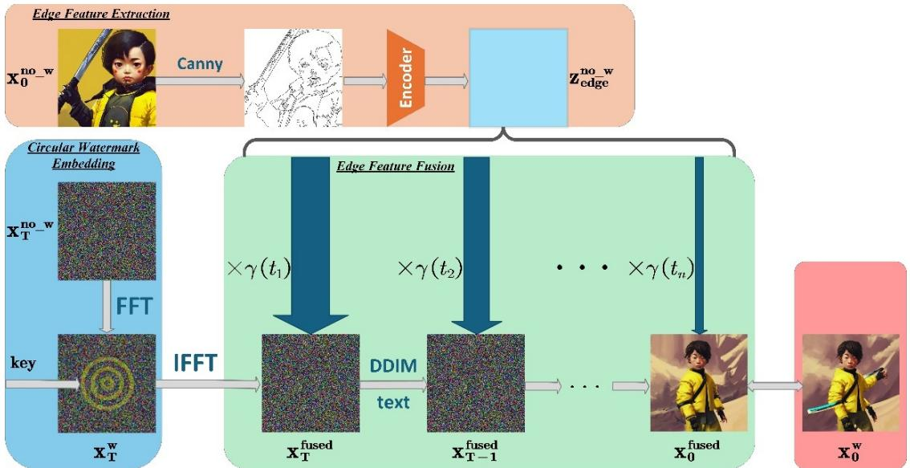
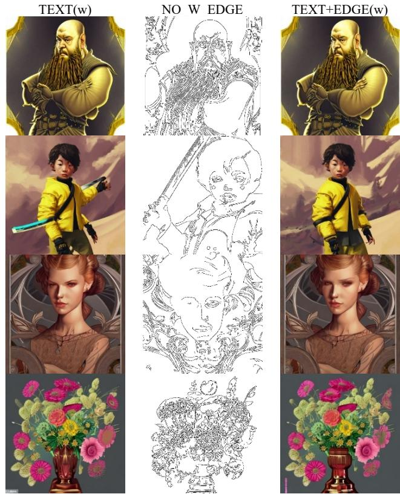
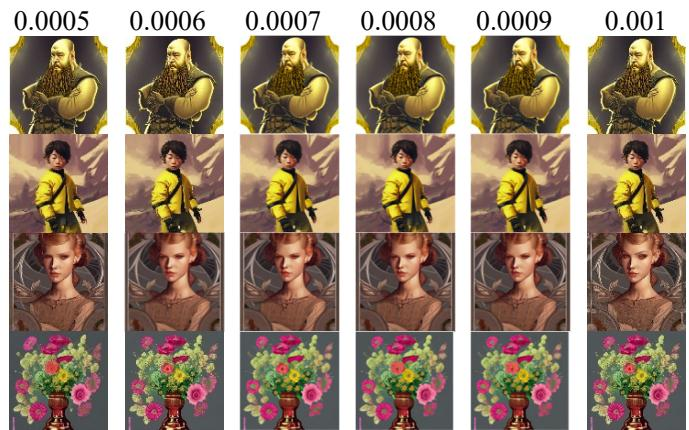

# Edge-Constrained Controllable Stable Diffusion Watermarking

Yuxuan Song *

Department of Cyberspace Security and Information Security, Zhengzhou University (ZZU), Zhengzhou, China

*e-mail: 16611695070@163.com

Abstract—Existing diffusion-based watermarking methods often experience latent distribution shifts, leading to structural distortions in the generated images. To tackle this issue, we propose the Edge-Constrained Controllable Stable Diffusion Watermarking (EC-CSW) framework, which incorporates edge features as geometric priors. This framework integrates multiscale edge features from the original, watermark-free images as geometric constraints, dynamically guiding the denoising process of the diffusion model. This method effectively balances the concealment of the watermark with the visual plausibility of the generated images. Experimental results, validated using 1,000 diverse text-image pairs based on the Stable Diffusion-v2 model, show that the proposed framework significantly mitigates the problems of unreasonable images caused by watermark embedding. This research offers innovative insights into the application of diffusion models in the field of watermarking, achieving a dual optimization of copyright protection and visual quality, and holds significant theoretical and practical implications.

# Keywords-Watermark; Stable Diffusion; Edge features;

# I. INTRODUCTION

With the rapid development of Artificial Intelligence Generated Content (AIGC) and digital media ecosystems, digital copyright protection faces heightened demands. Traditional encryption technologies ensure information security through ciphertext conversion, but their explicit protection mechanisms risk exposing data value. In contrast, digital watermarking technology, which implicitly embeds copyright information into carriers (spatial/frequency domains) while preserving visual quality, has emerged as a core technology for medical privacy [1], e-commerce authentication [2], and secure cloud transmission [3]. Current research focuses on multi-objective collaborative optimization: balancing the triangular trade-off among watermark embedding capacity, undetectability, and anti-attack robustness while simultaneously optimizing generative image quality and watermark extraction accuracy . Achieving dynamic unification of high-fidelity media preservation and watermark reversibility remains a critical challenge in information hiding.

Traditional watermarking algorithms primarily rely on spatial domain (e.g., LSB [4]) or frequency domain (DCT [5]/DWT [7]) embedding strategies, with their core dilemma lying in the trade-off among embedding capacity, robustness, and visual fidelity. Although adaptive methods (e.g., WOW [16], HUGO [15]) enhance concealment by optimizing embedding locations or dynamic adjustment strategies, they remain

constrained by low embedding capacity and insufficient antiattack capabilities. Early deep learning techniques (e.g., end-toend CNN [9], autoencoders [8], reversible neural networks [6][17]) advanced the co-optimization of capacity and robustness, yet their modification-based embedding inherently introduces statistically detectable traces.

The advent of AIGC has driven the evolution of generative watermarking, where watermarks are fused into the image generation pipeline through in-process embedding, eliminating the need for post-generation modification. GAN-based methods (e.g., DCGAN [10], WGAN-GP [11], CycleGAN [12]) encode watermarks into latent features but suffer from decoding errors caused by mode collapse and feature coupling interference. Addressing this, Liu et al. [13] proposed an Image Disentangled Autoencoder (IDEAS) to enhance robustness by decoupling structural and texture features, albeit with low watermark conversion efficiency. Zhou et al. [14] achieved reversible secret-to-image mapping (S2IRT) via the Glow model, improving capacity but exhibiting weak anti-attack performance. Recently, diffusion models, leveraging high-fidelity generation and mode coverage capabilities, have introduced new paradigms for covert watermark embedding. Existing methods (e.g., Fourier domain embedding [18], latent diffusion coupling [19], ZoDiAc [20]) inject watermarks through pre-trained models, yet the embedded watermarks disrupt original latent distributions, leading to structural distortion in generated images and degraded watermark reliability.

To address latent distribution shifts caused by existing diffusion-based techniques, which induce structural distortions, this paper proposes an innovative solution with the following core contributions:

1.We propose a novel watermarking framework that deeply integrates geometric edge priors with the diffusion process. By establishing an implicit geometric constraint mechanism, we achieve multi-objective co-optimization of watermark embedding and image generation, overcoming the limitations of unsupervised perturbation in latent space distributions inherent to existing methods.

2.The framework comprises three core modules: 1)Annular Frequency-Domain Watermark Embedding Module: Embeds rotation-resistant watermarks in the Fourier domain for robustness. 2)Edge-Aware Multi-Scale Feature Extraction Module: Extracts structural priors via an enhanced Canny operator.3)Dynamic Feature Fusion: Adaptively adjusts edge constraints during denoising to align with the original distribution.

  
Figure 1: Pipeline for Edge-Constrained Controllable Stable Diffusion Watermarking. Edge feature extraction captures structural priors, watermark embedding inserts a circular watermark in the Fourier domain, and feature fusion integrates edge features as conditional constraints into iterative denoising.

3.Experimental results demonstrate that our framework effectively mitigates structural distortion caused by distribution shifts, advancing the application of diffusion models in watermarking and achieving synergistic optimization of image rationality and watermark concealment.

This work provides a novel direction for reconciling highfidelity generation with imperceptible watermark integration, addressing critical challenges in the field of information hiding.

# II.METHODS

We propose an Edge-Constrained Controllable Stable Diffusion Watermarking (EC-CSW) framework to mitigate structural distortions caused by latent distribution shifts in existing methods. As illustrated in Figure 1, our framework comprises three tightly-coupled modules:

1.Edge Feature Extraction: A Canny operator extracts structural priors from the raw image $\mathbf { x _ { 0 } }$ , followed by an encoder to derive edge embeddings $\mathbf { z _ { e d g e } }$ ;   
2.Circular Watermark Embedding: In the Fourier domain, a rotation-resistant circular watermark is embedded via Fast Fourier Transform (FFT) and Inverse FFT (IFFT) operations;   
3.Edge Feature Fusion: During the iterative denoising process of the Denoising Diffusion Implicit Model (DDIM), edge features $\mathbf { z _ { e d g e } }$ are fused with diffusion latent variables $\bf { x } _ { t } { \ a s }$ conditional constraints to guide structurally-coherent generation.

# A. DDIM

A complete diffusion process comprises two stages: the forward process, which incrementally injects noise into the original data distribution, and the reverse process, which progressively denoises from randomly sampled Gaussian noise. In DDIM [22], the forward process can be formulated as:

$$
\mathbf {x} _ {t} = \sqrt {\alpha_ {t}} \mathbf {x} _ {t - 1} + \sqrt {1 - \alpha_ {t}} \boldsymbol {\epsilon}, \quad \boldsymbol {\epsilon} \sim \mathcal {N} (0, \mathbf {I}) \tag {1}
$$

where $\alpha _ { t }$ is the predefined noise schedule coefficient, $t \in [ 1 , T ]$ denotes the diffusion step, $\epsilon$ is sampled from a standard Gaussian distribution, and $\mathbf { x } _ { t }$ represents the noisy image at timestep $t$ . Equation (1) can be further derived as:

$$
\mathbf {x} _ {t} = \sqrt {\bar {\alpha} _ {t}} \mathbf {x} _ {0} + \sqrt {1 - \bar {\alpha} _ {t}} \epsilon \tag {2}
$$

where $\overline { { \alpha } } _ { t } = \prod \mathbf { \Gamma } _ { i = 0 } ^ { t } \alpha _ { i }$

The formula for the DDIM reverse generation process is as follows:

$$
\mathbf {x} _ {s} = \sqrt {\bar {\alpha} _ {s}} \hat {\mathbf {x}} _ {0 | t} + \sqrt {1 - \bar {\alpha} _ {s} - \sigma_ {s} ^ {2}} \boldsymbol {\epsilon} _ {\theta} (\mathbf {x} _ {t}, t) + \sigma_ {s} \epsilon \tag {3}
$$

$$
\hat {\mathbf {x}} _ {0 | t} = \frac {\mathbf {x} _ {t} - \sqrt {1 - \bar {\alpha} _ {t}} \boldsymbol {\epsilon} _ {\theta} (\mathbf {x} _ {t} , t)}{\sqrt {\bar {\alpha} _ {t}}} \tag {4}
$$

Using Equation (4), we predict at timestep , and then infer the image at timestep based on the predicted . In DDIM, the timesteps and need not be adjacent (e.g., $s = t - 1$ ) but must satisfy $s < t$ . When in Equation (3) is set to 0, the DDIM sampling process becomes deterministic. To eliminate stochastic interference with watermark embedding stability, this study empolys the deterministic sampling strategy of the Denoising Diffusion Implicit Model (DDIM). We formalize the iterative denoising process from to as follows:

$$
\mathbf {x} _ {0} = \mathcal {D} _ {\theta} \left(\mathbf {x} _ {T}; \boldsymbol {\epsilon} _ {\theta}, \mathbf {c}, T, 0\right) \tag {5}
$$

where $\epsilon _ { \theta }$ is a learnable noise predictor, and represents the textual prompt in DDIM.

# B. Frequency-Domain Annular Watermark Embedding

To avoid explicit watermark patterns in generated images caused by spatial-domain watermark embedding, this paper adopts a frequency-domain watermark embedding strategy

instead of traditional spatial-domain methods. Embedding watermarks in the Fourier domain offers two key advantages:

 Robustness to geometric attacks: The Fourier domain exhibits properties such as translation invariance, rotation invariance, and scale invariance.   
Imperceptibility: Embedding watermarks in the midfrequency components of the Fourier domain avoids human visual sensitivity to high-frequency details while being more robust than low-frequency embedding. In contrast, spatialdomain watermarks, which modify pixel-level values, often introduce artifacts in smooth regions.

Considering the critical role of watermark shape in robustness [18], we explore two watermark patterns:

 Random watermark: A fixed value sampled from a Gaussian distribution is embedded in the Fourier domain. This value retains Gaussian distribution characteristics, preserving the original vector distribution post-embedding. We hypothesize minimal impact on generated image quality, but this pattern lacks resistance to image attacks.   
 Annular watermark: Multiple concentric rings composed of fixed values sampled from Gaussian distributions are embedded. This design enhances robustness against geometric attacks (e.g., rotation) while maintaining minimal deviation from isotropic Gaussian distributions [18].

In this work, we employ the annular watermark as our embedding pattern. Specifically, we first randomly initialize a noise vector in Gaussian space, apply the Fourier transform, and then introduce a carefully designed multi-ring watermark pattern (referred to as a "key") near the center of the Fourier domain. Each ring corresponds to a fixed value. We define a binary mask $M$ and a key $k \in \mathbb { C } ^ { | M | }$ . For the initialized noise vector $\mathbf { x } _ { T }$ , its Fourier domain representation is formulated as:

$$
\mathcal {F} \left(\mathbf {x} _ {T}\right) _ {i} \sim \left\{ \begin{array}{l l} k _ {i} & i f i \in M \\ \mathcal {N} (0, 1) & o t h e r w i s e \end{array} \right. \tag {6}
$$

After watermark embedding, the Fourier domain representation is inversely transformed back to the spatial domain.

# C. Edge-Aware Feature Extraction

This study proposes a multi-scale edge feature extraction module based on the Canny operator to embed structural priors of original images into the latent space of the diffusion model, constraining the denoising trajectory via a dynamic weighted fusion strategy. Specifically:

1.Multi-scale edge feature extraction

 The watermark-free image $\mathbf { x } _ { 0 }$ generated by the diffusion model is saved locally.   
 Spatial smoothing is performed using an isotropic Gaussian kernel (size $5 \times 5$ ; standard deviation $\sigma$ is automatically calculated by the GaussianBlur function in OpenCV).

This operation suppresses high-frequency noise while preserving the primary edge topology. Subsequently, dual-

threshold gradient detection $\cdot T _ { l } = 5 0 , T _ { h } = 1 5 0 $ ) is performed using the Canny operator. Through non-maximum suppression and hysteresis thresholding, a continuous binary edge image $I _ { C a n n y } \in \mathbb { R } ^ { H \times W }$ is obtained, establishing a structural prior knowledge repository.

2.Latent Space Feature Encoding

 The Canny edge image $I _ { C a n n y } \in \mathbb { R } ^ { H \times W }$ undergoes channel expansion (converted to RGB) and is fed into the encoder module $E ( \cdot )$ of the variational autoencoder (VAE) in Stable Diffusion.   
 The edge image is mapped to a latent space vector $z _ { e d g e } = E ( I _ { C a n n y } )$ $\boldsymbol { z } _ { e d g e } \in \mathbb { R } ^ { d _ { z } }$ , transforming discrete edge topology into continuous latent representations to establish structural geometric priors.

# D. Dynamic Fusion of Edge Features

Considering the varying impact of different denoising stages on image generation [21], early denoising steps ( $t \to T$ ) dominate the generation of the main structural components. Enhancing edge constraints at this stage effectively preserves the geometric features of the original image. As the diffusion process progresses ( $\ell \to 1$ ), denoising gradually shifts toward detail synthesis, where reducing constraint strength allows the model to autonomously optimize local textures and avoid artifact issues caused by over-correction. We optimize the balance between structural preservation and detail generation in the diffusion model by designing an adaptive mechanism to dynamically adjust edge constraint intensity.

Specifically, we define a scaling factor function $\gamma ( t )$ across three stages (with $T$ as the total denoising steps and $t = T - i$ as the remaining steps at iteration $i$ ):

 Early Stage ( $\mathrm { \Omega } _ { t > \frac { 2 } { 3 } T }$ 2 ): A Gaussian decay strategy maintains high-intensity edge constraints. We use an initial scaling factor $\gamma _ { \mathrm { m a x } } = 0 . 0 0 0 5$ combined with a Gaussian function of standard deviation $\sigma _ { 1 } = T / 3$ , prioritizing geometric accuracy of the main structure.   
 Intermediate Stage ( $\frac { 1 } { 3 } T < t < \frac { 2 } { 3 } T \quad .$ ): Linear interpolation transitions the scaling factor from the Gaussian decay endpoint $\gamma _ { \mathrm { s t a r t } } { \approx } 0 . 0 0 0 3$ to a baseline value $\gamma _ { \mathrm { e n d } } = 0 . 0 0 0 1$ , balancing structural preservation and generative freedom.   
 Late Stage $\langle t \leqslant \frac { 1 } { 3 } T \rangle$ ): An exponential decay function gradually relaxes constraints, superimposing the baseline $\gamma _ { \mathrm { e n d } } = 0 . 0 0 0 1$ with an exponential term to prevent highfrequency detail distortion.

The overall formulation is described as:

$$
\gamma (t) = \left\{ \begin{array}{l l} 0. 0 0 0 5 \cdot \exp \left(- \frac {(T - t) ^ {2}}{2 \left(\frac {T}{3}\right) ^ {2}}\right), & t > \frac {2}{3} T \\ \underbrace {0 . 0 0 0 5 \cdot e ^ {- 0 . 5}} _ {\gamma_ {\text {s t a r t}}} + \left(\underbrace {0 . 0 0 0 1} _ {\gamma_ {\text {e n d}}} - \gamma_ {\text {s t a r t}}\right) \cdot \frac {\frac {2}{3} T - t}{\frac {1}{3} T}, & \frac {1}{3} T <   t \leq \frac {2}{3} T \\ 0. 0 0 0 1 + 0. 0 0 0 1 \cdot \exp \left(- \frac {t}{0 . 0 0 0 1 T}\right), & t \leq \frac {1}{3} T \end{array} \right. \tag {7}
$$

The dynamic scaling factor is weighted and fused into the latent variable at each denoising iteration step, formulated as:

$$
z _ {s} ^ {\text {f u s e d}} = z _ {t} + \sigma \left(\tilde {z} _ {\text {e d g e}}\right) \cdot \gamma (t), s, t \in (0, T) \text {a n d} s <   t \tag {8}
$$

where $\tilde { z } _ { e d g e }$ denotes the normalized edge features, $\sigma$ is the Sigmoid function, and $\mathcal { Z } _ { s } ^ { f u s e d }$ represents the fused latent variable at timestep . During the iterative denoising process, the output $z _ { s } ^ { f u s e d }$ at the current step is directly used as the input for the next step. After $t$ iterations, the final latent variable $z _ { 0 } ^ { f u s e d }$ is obtained and passed through the decoder module $D ( \cdot )$ of the VAE to decode the latent vector into the final watermarked image:

$$
\mathbf {x} _ {0} ^ {\text {f u s e d}} = D \left(z _ {0} ^ {\text {f u s e d}}\right) \tag {9}
$$

# III.EXPERIMENTAL RESULTS AND ANALYSIS

# A. Experimental Setup

This study constructs an experimental platform based on the state-of-the-art open-source latent text-to-image diffusion model, Stable Diffusion-v2 [23]. For data preparation, we utilize 1,000 text-image pairs from the Gustavosta/Stable-Diffusion-Prompts [24] dataset as foundational training samples. This dataset encompasses a wide range of diverse textual prompts covering multiple themes, styles, and scenarios, enabling robust support for generating highly diverse and creative images. In terms of model hyperparameters, we set the inference steps to 50 to balance generation quality and computational efficiency, with a default Classifier-Free Guidance scale of 7.5 to maintain textimage alignment stability. For watermark embedding, we design an annular watermark structure (radius: 10 pixels) and fix its embedding in the central image region to ensure imperceptibility. All experiments are conducted on a server equipped with dual NVIDIA RTX 2080 Ti GPUs (11GB VRAM each).

# B. Experimental Results

As shown in Figure 2, our edge-guided constraints significantly mitigate structural distortions in watermarked images generated by Stable Diffusion. Compared to the baseline method (Figure 2, left), which suffers from anatomical anomalies (e.g., blurred finger contours) and morphological deformities (e.g., distorted petals), our approach (Figure 2 middle) injects edge features ( $\dot { z } _ { e d g e } = E ( I _ { C a n n y } ) )$ as dynamic denoising constraints, reducing latent space shifts and improving visual-semantic alignment.

# C. Parameter Sensitivity Analysis

The edge feature scaling factor $\lambda$ significantly impacts the generated image quality (see Figure 3). Experimental results demonstrate:

 When $\lambda { = } 0 . 0 0 0 5$ , the watermarked image achieves optimal structural fidelity, with clear finger contours, intact petal shapes, and excellent watermark invisibility.

 As $\lambda$ increases to $0 . 0 0 0 6 \sim 0 . 0 0 1$ , the generation quality progressively degrades, manifesting as blurred finger edges, disproportionate eyeball ratios, and local petal deformations (visual distortions).

Based on comparative image results, this study selects $\lambda =$ 0.0005 as the optimal parameter. By precisely controlling the strength of edge constraints, it achieves the best balance between suppressing distortions and preserving fine details.

  
Figure 2: Generated results. Left column: Watermarked images generated by Stable Diffusion under text prompts only. Middle column: Edge maps of original non-watermarked images extracted via the Canny operator. Right column: Watermarked images generated by Stable Diffusion fused with original image edge features.

  
Figure 3. Visual Impact Analysis of Edge Feature Scaling Factor $\lambda$ on   
Generation Quality(Image-based comparison experiments; $\lambda$ range: 0.0005– 0.001; Key observation areas: Finger contours, eye proportions, petal morphology)

# IV.CONCLUSIONS

This paper introduces an edge-constrained diffusion watermarking framework to resolve structural distortions in generated images caused by latent distribution shifts during watermark embedding. By adaptively adjusting a timedependent scaling factor during the denoising process, the method dynamically modulates the intensity of edge constraints. This mechanism ensures alignment between generated content and the geometric priors of the original image distribution, effectively mitigating inconsistencies such as anatomical anomalies (e.g., blurred limb contours) and topological deformities (e.g., irregular petal arrangements). Experimental validation demonstrates that the time-adaptive scaling strategy stabilizes latent space trajectories, significantly improving structural fidelity while maintaining generative flexibility. This work lays the groundwork for future research in watermark encoding/decoding strategies and diffusion model applications, offering both theoretical significance and practical application value for digital rights management in AI-generated content.

# REFERENCES

[1] Zhou, X., & Lee, S. (2023, October). Hiding patient information in medical images: A high-capacity and reversible hiding algorithm for Ehealthcare. In 2023 Asia Pacific Signal and Information Processing Association Annual Summit and Conference (APSIPA ASC) (pp. 456- 461). IEEE.   
[2] Cheddad, A., Condell, J., Curran, K., & Kevitt, P.M. (2010). Digital image steganography: Survey and analysis of current methods. Signal Process., 90, 727-752.   
[3] Zhou, Z., Sun, H., Harit, R., Chen, X., & Sun, X. (2015). Coverless image steganography without embedding. In Cloud Computing and Security: First International Conference, ICCCS 2015, Nanjing, China, August 13- 15, 2015. Revised Selected Papers 1 (pp. 123-132). Springer International Publishing.   
[4] Chan, C. K., & Cheng, L. M. (2004). Hiding data in images by simple LSB substitution. Pattern recognition, 37(3), 469-474.   
[5] Khayam, S. A. (2003). The Discrete Cosine Transform (DCT): Theory and Application Technical Report. WAVES-TR-ECE802. 602.   
[6] Jing, J., Deng, X., Xu, M., Wang, J., & Guan, Z. (2021). Hinet: Deep image hiding by invertible network. In Proceedings of the IEEE/CVF international conference on computer vision (pp. 4733-4742).   
[7] Barni, M., Bartolini, F., & Piva, A. (2001). Improved wavelet-based watermarking through pixel-wise masking. IEEE transactions on image processing, 10(5), 783-791.   
[8] Zhu, J., Kaplan, R., Johnson, J., & Fei-Fei, L. (2018). Hidden: Hiding data with deep networks. In Proceedings of the European conference on computer vision (ECCV) (pp. 657-672).   
[9] Baluja, S. (2017). Hiding images in plain sight: Deep steganography. Advances in neural information processing systems, 30.   
[10] Hu, D., Wang, L., Jiang, W., Zheng, S., & Li, B. (2018). A novel image steganography method via deep convolutional generative adversarial networks. IEEE access, 6, 38303-38314.   
[11] Li, J., Niu, K., Liao, L., Wang, L., Liu, J., Lei, Y., & Zhang, M. (2020, July). A generative steganography method based on WGAN-GP. In International Conference on Artificial Intelligence and Security (pp. 386- 397). Singapore: Springer Singapore.   
[12] Li, Q., Wang, X., Wang, X., Ma, B., Wang, C., & Shi, Y. (2021). An encrypted coverless information hiding method based on generative models. Information Sciences, 553, 19-30.   
[13] Liu, X., Ma, Z., Ma, J., Zhang, J., Schaefer, G., & Fang, H. (2022). Image disentanglement autoencoder for steganography without embedding. In Proceedings of the IEEE/CVF conference on computer vision and pattern recognition (pp. 2303-2312).

[14] Zhou, Z., Su, Y., Li, J., Yu, K., Wu, Q. J., Fu, Z., & Shi, Y. (2022). Secretto-image reversible transformation for generative steganography. IEEE Transactions on Dependable and Secure Computing, 20(5), 4118-4134.   
[15] Pevný, T., Filler, T., & Bas, P. (2010). Using high-dimensional image models to perform highly undetectable steganography. In Information Hiding: 12th International Conference, IH 2010, Calgary, AB, Canada, June 28-30, 2010, Revised Selected Papers 12 (pp. 161-177). Springer Berlin Heidelberg.   
[16] Holub, V., & Fridrich, J. (2012, December). Designing steganographic distortion using directional filters. In 2012 IEEE International workshop on information forensics and security (WIFS) (pp. 234-239). IEEE.   
[17] Guan, Z., Jing, J., Deng, X., Xu, M., Jiang, L., Zhang, Z., & Li, Y. (2022). DeepMIH: Deep invertible network for multiple image hiding. IEEE Transactions on Pattern Analysis and Machine Intelligence, 45(1), 372- 390.   
[18] Wen, Y., Kirchenbauer, J., Geiping, J., & Goldstein, T. (2023). Tree-ring watermarks: Fingerprints for diffusion images that are invisible and robust. arXiv preprint arXiv:2305.20030.   
[19] Fernandez, P., Couairon, G., Jégou, H., Douze, M., & Furon, T. (2023). The stable signature: Rooting watermarks in latent diffusion models. In Proceedings of the IEEE/CVF International Conference on Computer Vision (pp. 22466-22477).   
[20] Zhang, L., Liu, X., Martin, A., Bearfield, C., Brun, Y., & Guan, H. (2024). Attack-resilient image watermarking using stable diffusion. Advances in Neural Information Processing Systems, 37, 38480-38507.   
[21] Mou, C., Wang, X., Xie, L., Wu, Y., Zhang, J., Qi, Z., & Shan, Y. (2024, March). T2i-adapter: Learning adapters to dig out more controllable ability for text-to-image diffusion models. In Proceedings of the AAAI conference on artificial intelligence (Vol. 38, No. 5, pp. 4296-4304).   
[22] Song, J., Meng, C., & Ermon, S. (2020). Denoising diffusion implicit models. arXiv preprint arXiv:2010.02502.   
[23] Rombach, R., Blattmann, A., Lorenz, D., Esser, P., & Ommer, B. (2022). High-resolution image synthesis with latent diffusion models. In Proceedings of the IEEE/CVF conference on computer vision and pattern recognition (pp. 10684-10695).   
[24] Gustavosta. (2023). Stable-Diffusion-Prompts [Source code]. GitHub. https://github.com/Gustavosta/Stable-Diffusion-Prompts